# FastWrap Backend Service Architecture

## System Flowchart

```mermaid
flowchart TB
    subgraph Client["🧑 Client (End User)"]
        U[User Interface]
        UC[User Chat Input]
        UR[User Receives Response]
    end

    subgraph Store["🏪 Store Frontend"]
        SF[Store Frontend Application]
        CM[Chat Manager]
        RM[Role Manager]
        PS[Product Selection UI]
    end

    subgraph Server["⚙️ Server (FastAPI Backend)"]
        API[FastAPI Server<br/>Port: 8555]
        
        subgraph Endpoints["API Endpoints"]
            E1["/api/chat"]
            E2["/api/characters"]
            E3["GET /api/characters/{uuid}"]
            E4["PATCH /api/characters/{uuid}"]
            E5["DELETE /api/characters/{uuid}"]
            E6["/health"]
            E7["/"]
        end

        subgraph Services["Business Logic"]
            CS[Chat Service]
            CHS[Character Service]
            LA[LangChain Agent]
            TOOL[check_products Tool]
        end

        subgraph Storage["Data Storage"]
            REDIS[(Redis Cache<br/>TTL: 300s)]
            SQLITE[(SQLite DB<br/>characters.db)]
        end

        subgraph External["External Services"]
            LLM[LLM Provider<br/>via LangChain]
        end
    end

    %% Client to Store interactions
    U -->|"Interacts with"| SF
    UC -->|"Sends message"| CM
    PS -->|"Views products"| UR

    %% Store to Server API calls
    CM -->|"POST message"| E1
    RM -->|"POST create role"| E2
    RM -->|"GET fetch role"| E3
    RM -->|"PATCH update role"| E4
    RM -->|"DELETE remove role"| E5
    SF -->|"Check status"| E6
    SF -->|"Get info"| E7

    %% Internal Server flows
    E1 -->|"store_message()"| CS
    E2 -->|"store_character()"| CHS
    E3 -->|"get_character()"| CHS
    E4 -->|"update_character()"| CHS
    E5 -->|"delete_character()"| CHS

    %% Service to Storage
    CS -->|"Cache conversation"| REDIS
    CHS -->|"CRUD operations"| SQLITE

    %% Chat flow with LangChain
    CS -->|"Process message"| LA
    LA -->|"Check inventory"| TOOL
    LA -->|"Generate response"| LLM
    
    %% RAG System
    CHS -->|"Provides context"| LA
    SQLITE -->|"Agent roles & instructions"| LA

    %% Response flow back
    LLM -->|"AI response"| LA
    LA -->|"Formatted response"| CS
    CS -->|"Return to Store"| CM
    CM -->|"Display to user"| UR

    %% Visual styling
    classDef clientStyle fill:#e1f5fe,stroke:#01579b,stroke-width:2px
    classDef storeStyle fill:#fff3e0,stroke:#e65100,stroke-width:2px
    classDef serverStyle fill:#f3e5f5,stroke:#4a148c,stroke-width:2px
    classDef storageStyle fill:#e8f5e9,stroke:#1b5e20,stroke-width:2px
    classDef externalStyle fill:#fce4ec,stroke:#880e4f,stroke-width:2px
    
    class Client clientStyle
    class Store storeStyle
    class Server,Endpoints,Services serverStyle
    class Storage storageStyle
    class External externalStyle
```

## Data Flow Description

### 1. **Client Layer**
- End users interact with the store frontend
- Send chat messages and view product responses
- Receive AI-powered assistance for product selection

### 2. **Store Layer (Frontend)**
- Manages user interface and interactions
- **Chat Manager**: Handles conversation flow using `/api/chat`
- **Role Manager**: Configures chatbot personality/instructions via `/api/characters`
- **Product Selection UI**: Displays available products and recommendations

### 3. **Server Layer (Backend)**

#### API Endpoints:
- **`POST /api/chat`**: Receives chat messages, caches in Redis
- **`POST /api/characters`**: Creates new agent roles/instructions
- **`GET /api/characters/{uuid}`**: Retrieves specific role configuration
- **`PATCH /api/characters/{uuid}`**: Updates existing roles
- **`DELETE /api/characters/{uuid}`**: Removes role configurations
- **`GET /api/characters`**: Lists all available roles
- **`GET /health`**: Service health check
- **`GET /`**: Service information

#### Services:
- **Chat Service**: Manages message flow and Redis caching
- **Character Service**: Handles CRUD operations for agent roles
- **LangChain Agent**: Processes messages with configured instructions
- **Tools**: `check_products` tool for inventory queries

#### Storage:
- **Redis**: Temporary chat cache (5-minute TTL)
- **SQLite**: Persistent storage for character roles and instructions

#### External Integration:
- **LLM Provider**: Connected via LangChain for AI responses

## RAG System Structure

The RAG (Retrieval-Augmented Generation) system is structured as follows:

1. **Context Storage**: Character roles and instructions stored in SQLite
2. **Context Retrieval**: Character Service fetches relevant role/instructions based on UUID
3. **Context Injection**: LangChain Agent receives instructions from database
4. **Tool Augmentation**: `check_products` tool provides real-time inventory data
5. **Response Generation**: LLM generates contextual responses based on role + tools

## Message Flow Example

## Key Features

- **Microservice Architecture**: Separation of concerns between chat, character management, and storage
- **Caching Strategy**: Redis for temporary conversation storage
- **Persistent Roles**: SQLite for long-term agent configuration
- **Tool Integration**: Product checking capabilities via LangChain tools
- **RESTful API**: Standard HTTP methods for all operations
- **Containerization**: Docker support for easy deployment

## Can't visualize flowcharts?

If you cannot visualize the flowchart, either:

- Install a mermaid chart extension in your IDE, or;
- Copy paste the Mermaid code into [Mermaid Live Editor](https://mermaid.live) to visualize it.